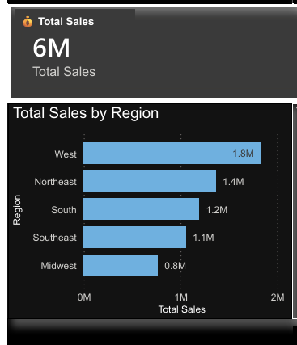

# Adidas Sales Analysis Dashboard

## Project Overview
This project analyzes Adidas sales performance using Power BI and Excel. The dashboard provides insights into sales trends, regional performance, product categories, profitability, and retailer contributions.

## Objectives
- Analyze overall sales performance
- Identify top-performing regions
- Compare product category sales
- Evaluate retailer contributions
- Track sales growth over time

## Tools Used
- Microsoft Excel
- Power BI
- GitHub

## Key Metrics
- Total Sales: 6M
- Units Sold: 128K
- Operating Margin: 42.37%
- Operating Profit: 2.45M

## Key Insights
- West region generated the highest sales (1.8M).
- Online and retail channels contributed significantly to revenue.
- Footwear products dominated sales.
- Sales increased significantly from 2020 to 2021.

## Dashboard Screenshots

## Dashboard Overview

## KPI & Revenue View

## Regional Sales Analysis

## Files Included
- Adidas_Sales_Data.xlsx
- Adidas_Sales_Dashboard.pbix
- Dashboard PDF Report

## Author
B Uday Kumar
